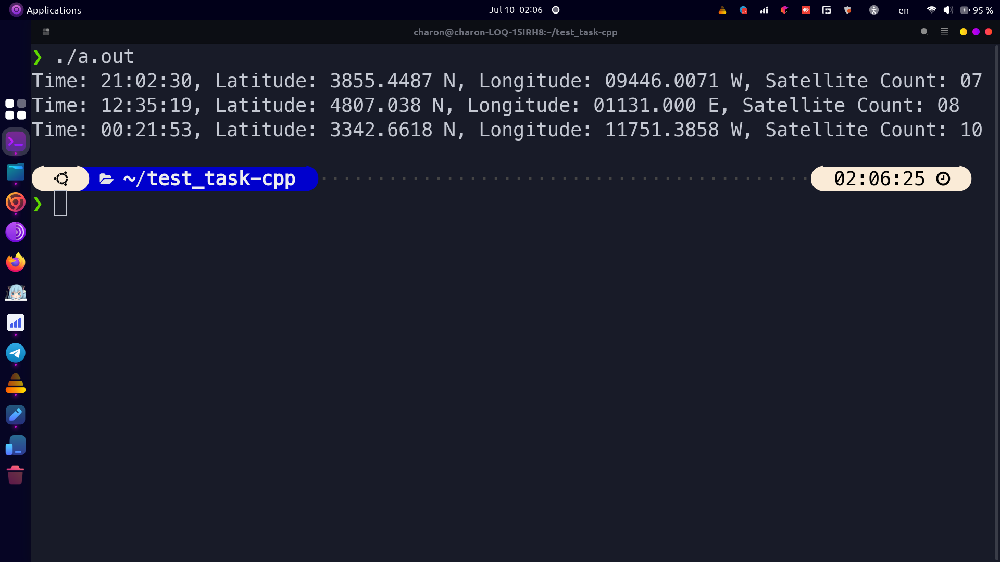
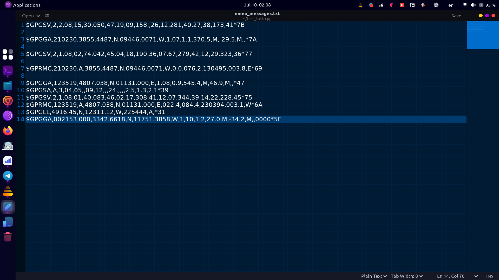

# NMEA GPGGA Data Processor

This project is a C++ application designed to read and process NMEA GPGGA sentences from a text file. The program extracts key information such as time, latitude, longitude, and the number of satellites from each GPGGA sentence and displays it in a readable format.





## Features

- Parses NMEA GPGGA sentences.
- Extracts and formats the time, latitude, longitude, and satellite count.
- Reads from a specified text file containing NMEA messages.
- Handles various edge cases and invalid data gracefully.
- Outputs the extracted data in a human-readable format.

## Getting Started

### Prerequisites

- A C++11 compatible compiler (e.g., g++, clang++)
- Basic knowledge of command-line operations

### Installation

1. **Clone the repository**:
    ```sh
    git clone https://github.com/yourusername/nmea-gpgga-processor.git
    cd nmea-gpgga-processor
    ```

2. **Prepare your data**:
    - Ensure you have a text file (e.g., `nmea_messages.txt`) containing NMEA GPGGA sentences.
    - Place this file in the same directory as the source code.

## Usage

### Compilation

To compile the program, use the following command:
```sh
g++ -o gpgga_processor main.cpp
```

### Execution

To run the executable, use the following command:
```sh
./gpgga_processor
```

Ensure that the `nmea_messages.txt` file is in the same directory as the executable or specify the full path to the file in the source code.

## Example Output

When you run the program, you will see output similar to the following if the input file contains valid GPGGA sentences:

```
Time: 12:34:56, Latitude: 4807.038 N, Longitude: 01131.000 E, Satellite Count: 8
Time: 12:35:01, Latitude: 4807.123 N, Longitude: 01131.456 E, Satellite Count: 10
```

## Code Overview

The main components of the project are:

- **GPGGAData struct**: A structure to hold the parsed GPGGA data fields.
- **process_gpgga_line function**: Parses a single GPGGA line and populates a GPGGAData object.
- **read_and_process_file function**: Reads the file line by line, processes each GPGGA line, and stores the results.
- **main function**: The entry point of the application, which handles file reading and data output.

## Error Handling

- The program checks if the file can be opened successfully.
- It verifies that each line contains a valid GPGGA sentence before attempting to parse it.
- If an error occurs during parsing, the program skips the invalid line and continues processing the next line.

## Dependencies

- C++11 or later

## License

This project is licensed under the MIT License. See the [LICENSE](LICENSE) file for details.

## Contributing

Contributions are welcome! Please fork the repository and submit a pull request for any improvements or bug fixes.

## Contact

For any questions or suggestions, feel free to open an issue or contact me at [sarhadiesmail@gmail.com].

